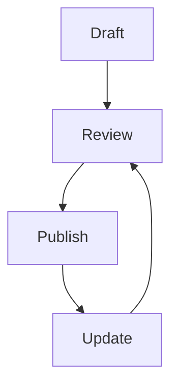

## Overview

Bill Hunter provides powerful tools to manage your documentation projects effectively. You can organize content into structured projects, collaborate with teams in real-time, track changes with version history, search across documents, and export or share your work seamlessly. These features streamline your workflow, whether you're building internal wikis or public docs sites.

<Callout kind="info">
Bill Hunter's core features integrate seamlessly, allowing you to focus on content creation rather than tool management.
</Callout>

## Key Features

Discover the main capabilities at a glance.

<Columns cols={3}>
  <Card title="Project Organization" icon="folder" href="#project-organization">
    Group documents logically into projects for better navigation.
  </Card>
  <Card title="Team Collaboration" icon="users" href="#collaboration">
    Work together with real-time editing and comments.
  </Card>
  <Card title="Version Control" icon="git-branch" href="#version-control">
    Track changes and revert to previous versions easily.
  </Card>
  <Card title="Search & Tags" icon="search" href="#search-tagging">
    Find content quickly using powerful search and tags.
  </Card>
  <Card title="Export & Share" icon="share-2" href="#export-sharing">
    Publish or export docs in multiple formats.
  </Card>
</Columns>

## Project Organization

Organize your documents into projects to maintain structure.

### Create a New Project

<Steps>
  <Step title="Navigate to Projects" icon="folder">
    Click the `Projects` tab in the sidebar.
  </Step>
  <Step title="Add Project" icon="plus">
    Select `New Project` and enter a name like `API Docs`.
  </Step>
  <Step title="Add Documents" icon="file-text">
    Drag files or create new MDX pages within the project.
  </Step>
</Steps>

Projects support nested folders for complex hierarchies.

## Team Collaboration

Collaborate efficiently with your team.

<Tabs>
  <Tab title="Real-time Editing" icon="edit-3">
    Multiple users edit simultaneously. Changes appear instantly.

    <CodeGroup tabs="JavaScript,Python">
    ````javascript
    // Example: Embed collaborative editor
    import { CollaborativeEditor } from '@billhunter/sdk';

    const editor = new CollaborativeEditor({
      projectId: 'proj_123',
      apiKey: 'YOUR_API_KEY'
    });
    ````
    ````python
    # Python integration example
    from billhunter import CollaborativeEditor

    editor = CollaborativeEditor(project_id='proj_123', api_key='YOUR_API_KEY')
    ````
    </CodeGroup>
  </Tab>
  <Tab title="Comments & Mentions" icon="message-circle">
    Add comments to sections and `@mention` teammates.

    Use `@username` to notify collaborators directly.
  </Tab>
</Tabs>

<Callout kind="tip">
Invite team members via email or share project links for instant access.
</Callout>

## Version Control and History

Track every change with built-in version control.

View commit history, compare diffs, and restore versions.



<Expandable title="Advanced Versioning" default-open="false">
  Configure branching for large projects:

  | Feature       | Description                  |
  |---------------|------------------------------|
  | Branches     | Create feature branches     |
  | Merge        | Pull requests with reviews  |
  | Rollback     | Revert to any commit        |
</Expandable>

## Search and Tagging

Quickly locate content with full-text search and tags.

Assign tags like `api`, `guide` during creation. Search supports filters.

## Export and Sharing

Share your docs widely.

<Columns cols={2}>
  <Card title="Export Formats" icon="download">
    PDF, HTML, Markdown.
  </Card>
  <Card title="Public Links" icon="link-2">
    Generate shareable URLs with permissions.
  </Card>
</Columns>

Customize exports with themes matching your brand color `#3B82F6`.